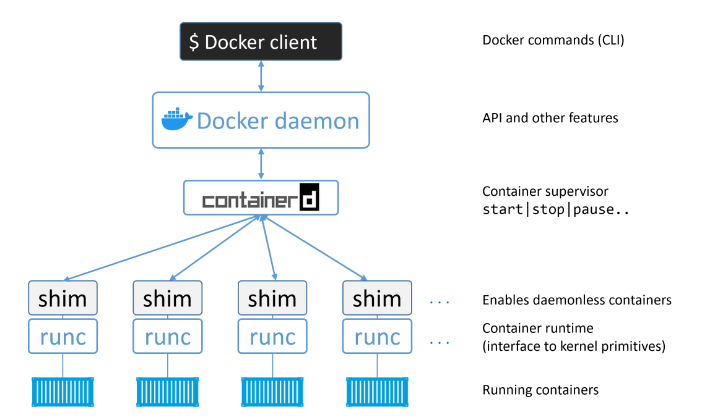
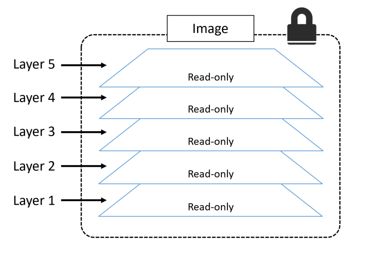
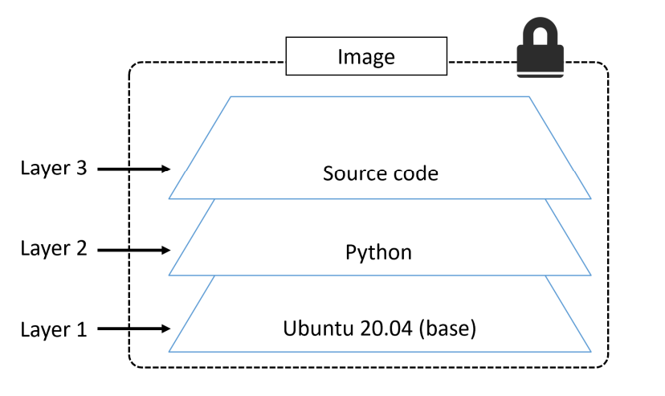
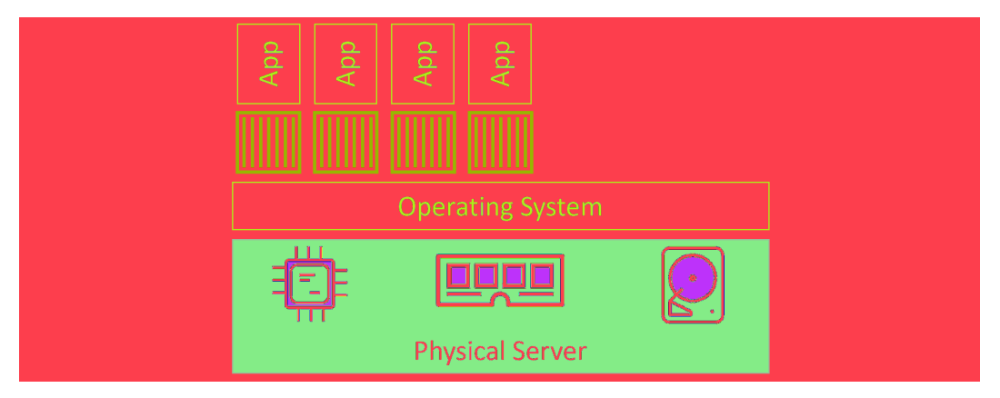
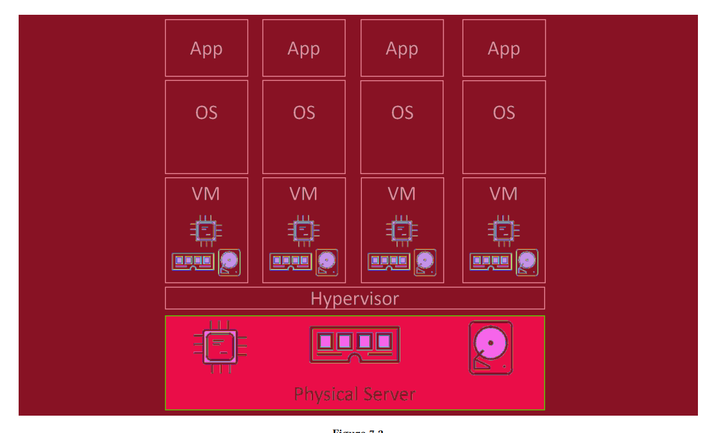

# Docker Deep Dive

> A comprehensive guide to understanding Docker internals — from architecture to image layers, networking, and Compose.

---

## Table of Contents

- [Docker Architecture](#docker-architecture)
  - [The Big Picture](#the-big-picture)
  - [Docker Client](#docker-client)
  - [Docker Engine API](#docker-engine-api)
  - [Docker Daemon (dockerd)](#docker-daemon-dockerd)
  - [containerd](#containerd)
  - [shim](#shim)
  - [runc](#runc)
- [Docker Images](#docker-images)
  - [What Is an Image?](#what-is-an-image)
  - [What Is an Image Layer?](#what-is-an-image-layer)
  - [How Layers Stack](#how-layers-stack)
  - [Layer Storage — OverlayFS](#layer-storage--overlayfs)
  - [Dangling Images](#dangling-images)
  - [Tags vs Digests](#tags-vs-digests)
- [Dockerfile Deep Dive](#dockerfile-deep-dive)
  - [Dockerfile Instructions Explained](#dockerfile-instructions-explained)
  - [CMD vs ENTRYPOINT](#cmd-vs-entrypoint)
- [Docker vs Virtual Machines](#docker-vs-virtual-machines)
- [Docker Compose](#docker-compose)
  - [What Is Docker Compose?](#what-is-docker-compose)
  - [What Is a YAML File?](#what-is-a-yaml-file)
  - [Compose File Explained](#compose-file-explained)
- [Useful Commands Cheatsheet](#useful-commands-cheatsheet)

---

## Docker Architecture

### The Big Picture

Docker is not a single program — it is a **layered system** of components that each have a specific responsibility. Understanding how they work together is key to truly mastering Docker.



Here is the full communication flow:

```
Docker CLI  (you type a command)
    │
    │  HTTP / REST over Unix socket (/var/run/docker.sock) or TCP
    ▼
Docker Engine API  (dockerd)
    │
    │  gRPC
    ▼
containerd
    │
    │  gRPC
    ▼
runc  (OCI runtime)
    │
    │  syscalls
    ▼
Linux Kernel  (namespaces, cgroups)
```

You can even send raw HTTP requests directly to the Docker socket yourself to see what's running:

```bash
curl --unix-socket /var/run/docker.sock http://localhost/containers/json
```

This confirms that Docker is really just an HTTP API under the hood.

---

### Docker Client

The **Docker client** (`docker`) is the primary tool you interact with. When you type:

```bash
docker run nginx
docker build -t myapp .
docker ps
```

You are talking to the **Docker client**. It translates your commands into **HTTP REST API calls** and sends them to the Docker daemon over a Unix socket (`/var/run/docker.sock`) or optionally over TCP.

The client itself does **nothing** — it is just a messenger.

---

### Docker Engine API

The **Docker Engine API** is a REST API exposed by `dockerd`. It defines all the endpoints the client calls:

| Action | API Endpoint |
|--------|-------------|
| List containers | `GET /containers/json` |
| Start container | `POST /containers/{id}/start` |
| Build image | `POST /build` |
| Pull image | `POST /images/create` |

The API listens on a **Unix socket** by default:

```
/var/run/docker.sock
```

It can also be exposed over **TCP** for remote access (requires TLS in production).

---

### Docker Daemon (dockerd)

The **Docker daemon** (`dockerd`) is the brain of Docker. It is the main service that manages Docker objects and communicates with containerd to create and manage containers. It is a long-running background service that:

- Receives commands from the Docker client via the REST API
- Manages Docker objects: images, containers, volumes, networks
- Delegates the actual container work to **containerd** via gRPC

```
You type:  docker run nginx
           ↓
dockerd receives the API call
           ↓
dockerd tells containerd: "start a container from nginx image"
```

`dockerd` does NOT create containers directly anymore — that job was handed off to `containerd` to keep concerns separated.

---

### containerd

**containerd** (pronounced *container-dee*) is a high-level container runtime. It was extracted from Docker and donated to the CNCF (Cloud Native Computing Foundation), and is now used by Kubernetes as well. Its primary purpose is to manage container lifecycle operations such as start, stop, pause, and delete.

### Responsibilities

- Pull images from registries
- Manage image storage
- Manage container lifecycle: **start | stop | pause | resume | delete**
- Manage container snapshots (e.g., via OverlayFS)
- Delegate container creation and execution to **runc**

```
containerd = "the manager"
runc       = "the worker"
```

containerd talks to dockerd via **gRPC**, and talks to runc via the **OCI spec**.

---

### shim

The **shim** is a small, lightweight process that sits between `containerd` and the actual container process.

Its purpose is critical:

> **If `dockerd` or `containerd` crashes — your running containers keep running.**

How? Because the shim:

1. Becomes the **parent process** of the container after `runc` exits
2. Keeps `stdin/stdout/stderr` open so logs still work
3. Reports the container's exit code back to `containerd` when it finishes
4. Allows `containerd` to be restarted without killing containers

Each container gets **its own shim process**. You can see them with:

```bash
ps aux | grep containerd-shim
```

---

### runc

**runc** has one job: **create containers**.

It is the low-level OCI (Open Container Initiative) runtime that talks directly to the Linux kernel. Here is exactly what runc does when it creates a container:

```
    Sets up Linux namespaces
     → PID namespace     (isolated process tree)
     → Network namespace (isolated network stack)
     → Mount namespace   (isolated filesystem)
     → UTS namespace     (isolated hostname)
     → IPC namespace     (isolated inter-process communication)

    Applies cgroups
     → CPU limits
     → Memory limits
     → I/O limits

    Sets up the root filesystem
     → Mounts the image layers using OverlayFS

    Executes the container process (PID 1)
     → Hands off to the shim
     → runc exits — its job is done
```

> runc is ephemeral. It starts, creates the container, then **exits**. It does not stay running.

---

## Docker Images

### What Is an Image?

A Docker image is a **lightweight, standalone, executable software package** that includes everything needed to run an application:

- The code / binary
- A runtime (Node, Python, Java, etc.)
- System libraries and tools
- Configuration

Images are:
- **Read-only** — you never modify an image directly
- **Layered** — built from stacked filesystem snapshots
- **Portable** — run the same on any machine with Docker

Images are stored in **registries**:
- Public: [Docker Hub](https://hub.docker.com)
- Private: self-hosted or cloud-based (AWS ECR, GitHub Container Registry, etc.)

---

### What Is an Image Layer?



A Docker image layer is a **read-only filesystem snapshot** created by each instruction in a Dockerfile.

Key properties of layers:

| Property | Description |
|----------|-------------|
| **Read-only** | Layers can never be modified after creation |
| **Reusable** | Multiple images share identical layers |
| **Incremental** | Each layer only stores the *diff* from the previous one |
| **Cached** | Docker skips rebuilding unchanged layers |
| **Identified by SHA256** | Each layer has a unique hash |

> Only the **topmost layer** of a running container is writable — this is called the **Container Layer** or **Copy-on-Write layer**. It is destroyed when the container is removed.

---

### How Layers Stack



Let's trace a real example step by step:

```dockerfile
FROM ubuntu:20.04          # Layer 1
RUN apt install python3    # Layer 2
COPY app.py /app/app.py    # Layer 3
```

#### Layer 1 — Base Image

```
FROM ubuntu:20.04
```

Ubuntu itself is already composed of multiple internal layers. For your image, this becomes your foundation:

```
[ Layer 1: Ubuntu 20.04 ]
  /bin, /usr, /lib, /etc, core system files
```

#### Layer 2 — Installing Python

```
RUN apt update && apt install -y python3
```

Docker runs this command in a temporary container on top of Layer 1, then **snapshots the filesystem changes**. Only the new/modified files are stored:

```
[ Layer 2: Python installed    ]  ← only the diff (new binaries, libs)
[ Layer 1: Ubuntu 20.04        ]
```

> Layer 2 does NOT copy all of Ubuntu. It only stores what changed.

#### Layer 3 — Add Your Code

```
COPY app.py /app/app.py
```

```
[ Layer 3: app.py              ]  ← only app.py
[ Layer 2: Python installed    ]
[ Layer 1: Ubuntu 20.04        ]
```

#### Running Container — Writable Layer

When you start a container from this image, Docker adds one more layer on top:

```
[ Container Layer (writable)   ]  ← temporary, deleted on rm
[ Layer 3: app.py              ]
[ Layer 2: Python installed    ]
[ Layer 1: Ubuntu 20.04        ]
```

All layers below are still **read-only**. If a container modifies a file from a lower layer, Docker copies it up to the writable layer first — this is called **Copy-on-Write (CoW)**.

---

### How to Inspect Layers

```bash
# See the pull layers live
docker pull ubuntu:latest

# Count the layers
docker image inspect ubuntu:latest | grep -c "sha256"

# See build history (approximate layer view)
docker image history ubuntu:latest
```

---

### Layer Storage — OverlayFS

Docker stores layers on disk using **OverlayFS**, a union filesystem built into the Linux kernel.

OverlayFS merges multiple read-only directories into a single unified view:

```
upperdir  (writable container layer)   ← changes go here
lowerdir  (read-only image layers)     ← stacked beneath
merged    (what the container sees)    ← unified view
```

Metadata about cached layers is tracked in `cache.db` inside containerd's data directory.

Benefits:
- Multiple containers can share the same image layers without duplication
- Only the writable layer differs per container
- Makes storage extremely efficient

---

### Dangling Images

When you rebuild an image with the same tag:

```bash
docker build -t myapp:latest .   # First build → image A
# ... you edit your Dockerfile ...
docker build -t myapp:latest .   # Second build → image B
```

Docker:
1. Creates **image B**
2. Moves the `myapp:latest` tag to image B
3. Image A **loses its tag** and becomes `<none>:<none>`

That tagless, unreferenced image is called a **dangling image**.

```bash
# View dangling images
docker image ls --filter dangling=true

# Remove dangling images
docker image prune

# Remove ALL unused images (not just dangling)
docker image prune -a
```

> Run `docker image prune -a` regularly to free up disk space on development machines.

---

### Tags vs Digests

#### The Problem with Tags

Tags are **mutable**. The same tag can point to different images over time:

```
Day 1:  myapp:latest → Image A  (sha256:AAA...)
Day 5:  myapp:latest → Image B  (sha256:BBB...)  ← developer pushed an update
```

If you pull `myapp:latest` on Day 1 and again on Day 5, you get **different images** with potentially different behavior. This is dangerous in production.

#### Digest = Immutable Identity

A **digest** is the SHA256 hash of the image content. It is calculated from the actual bytes of the image.

```
If content changes → digest changes
Same digest = guaranteed same image, always
```

```bash
docker pull alpine
# Output includes:
# Digest: sha256:9cacb71397b640eca97488cf08582ae4e4068513101088e9f96c9814bfda95e0
```

#### Tag vs Digest Comparison

| | Tag | Digest |
|---|---|---|
| **Analogy** | Nickname | National ID number |
| **Mutable?** | Yes — can be reassigned | No — content-derived |
| **Example** | `alpine:latest` | `alpine@sha256:9cacb71...` |
| **Safe for prod?** | Risky | Guaranteed |

#### Pulling by digest (production-safe)

```bash
docker pull alpine@sha256:9cacb71397b640eca97488cf08582ae4e4068513101088e9f96c9814bfda95e0
```

This guarantees you get **exactly** that image, regardless of what `latest` points to.

---

## Dockerfile Deep Dive

### Dockerfile Instructions Explained

```dockerfile
# Base image
FROM node:20-alpine

# Set working directory
WORKDIR /app

# Copy dependency files first (cache optimization)
COPY package*.json ./

# Install dependencies
RUN npm install

# Copy application source
COPY . .

# Expose documentation (does NOT publish the port)
EXPOSE 3000

# Default startup command
CMD ["node", "app.js"]
```

| Instruction | What it does | Creates a layer? |
|-------------|--------------|-----------------|
| `FROM` | Sets the base image | No (references existing) |
| `WORKDIR` | Sets working directory (creates if missing) | Yes |
| `COPY` | Copies files from host into image | Yes |
| `ADD` | Like COPY but also supports URLs and auto-extracts archives | Yes |
| `RUN` | Executes a command during build | Yes |
| `ENV` | Sets environment variables | Yes |
| `EXPOSE` | Documents which port the container uses | No |
| `CMD` | Default command when container starts | No |
| `ENTRYPOINT` | Sets the main executable of the container | No |
| `VOLUME` | Declares a mount point | Yes |
| `ARG` | Build-time variable (not available at runtime) | No |
| `LABEL` | Adds metadata to the image | Yes |

> **Layer caching tip:** Put instructions that change rarely (`RUN apt install`) **before** instructions that change often (`COPY . .`). Docker caches layers in order — if an early layer is unchanged, it reuses the cache for all subsequent layers.

---

### CMD vs ENTRYPOINT

This is one of the most commonly misunderstood parts of Docker.

#### CMD

```dockerfile
CMD ["node", "app.js"]
```

- Defines the **default command** when the container starts
- Can be **overridden** at runtime:

```bash
docker run myapp bash    # overrides CMD — runs bash instead
```

#### ENTRYPOINT

```dockerfile
ENTRYPOINT ["node", "app.js"]
```

- Defines the **main executable** of the container
- Cannot be overridden at runtime without `--entrypoint` flag
- Arguments passed via `docker run` are **appended** to ENTRYPOINT

```bash
docker run myapp --port 8080
# runs: node app.js --port 8080
```

#### Using Both Together

```dockerfile
ENTRYPOINT ["node", "app.js"]
CMD ["--port", "3000"]
```

- `ENTRYPOINT` = the fixed executable
- `CMD` = the default arguments (overridable)

```bash
docker run myapp                    # → node app.js --port 3000
docker run myapp --port 8080        # → node app.js --port 8080
```

#### Summary

| | CMD | ENTRYPOINT |
|---|---|---|
| **Role** | Default arguments | Fixed executable |
| **Overridable?** | Yes | Only with `--entrypoint` |
| **Runtime args** | Replace CMD | Append to ENTRYPOINT |
| **Use case** | Flexible containers | Fixed-purpose containers |

> **Best practice:** Use `ENTRYPOINT` for the main process and `CMD` for default arguments. Always use the **exec form** `["executable", "arg"]` — not the shell form `"executable arg"` — for correct signal handling (PID 1).

---

## Docker vs Virtual Machines

| | Docker Container | Virtual Machine |
|---|---|---|
| **OS** | Shares host kernel | Full OS per VM |
| **Size** | MBs | GBs |
| **Startup** | Milliseconds to seconds | Minutes |
| **Isolation** | Process-level (namespaces) | Hardware-level (hypervisor) |
| **Overhead** | Very low | High |
| **Portability** | Excellent | Good |
| **Use case** | Microservices, CI/CD, apps | Full OS emulation, legacy apps |

### Docker — How it works



Containers share the **host OS kernel**. Each container gets isolated namespaces (its own PID tree, network, filesystem view), but they all run on the same kernel. This makes them lightweight and fast.

```
Host OS (Linux kernel)
├── Container A (nginx)     ← isolated namespace
├── Container B (postgres)  ← isolated namespace
└── Container C (redis)     ← isolated namespace
```

### Virtual Machine — How it works



Each VM runs a **complete operating system** on top of a **hypervisor** (like VMware, VirtualBox, or KVM). The hypervisor emulates hardware so each VM thinks it has its own CPU, RAM, and disk.

```
Physical Hardware
└── Hypervisor
    ├── VM 1 (Ubuntu + nginx)    ← full OS
    ├── VM 2 (CentOS + postgres) ← full OS
    └── VM 3 (Debian + redis)    ← full OS
```

### When to use which?

| Scenario | Docker | VM |
|----------|--------|----|
| Microservices | Ideal | Overkill |
| CI/CD pipelines | Ideal | Slow |
| Full OS isolation needed | Not suitable | Ideal |
| Legacy app requiring specific OS | Risky | Ideal |
| Development environment | Great | Heavy |

---

## Docker Compose

### What Is Docker Compose?

**Docker Compose** is a tool for defining and running **multi-container applications**. Instead of running multiple `docker run` commands manually and wiring everything together, you describe your entire stack in a single **YAML file** (`docker-compose.yml`) and manage it with simple commands.

```bash
docker compose up      # Start the entire stack
docker compose down    # Stop and remove everything
docker compose logs    # View all logs
docker compose ps      # See status of all services
```

Compose is useful in **every environment**:
- Development
- Testing / CI
- Staging / Production

It manages the full lifecycle of your application:
- Build images
- Start, stop, rebuild services
- View service status
- Stream logs
- Run one-off commands inside containers

---

### What Is a YAML File?

**YAML** (YAML Ain't Markup Language) is a human-readable data serialization format. Docker Compose uses it to define services, networks, and volumes.

Key rules:
- Indentation uses **spaces** (never tabs)
- Structure is defined by indentation level
- Lists use `-` prefix
- Key-value pairs use `:`

```yaml
# YAML example
name: nginx
port: 443
features:
  - https
  - proxy
  - tls
```

> YAML is a superset of JSON — valid JSON is also valid YAML.

---

### Compose File Explained

```yaml
version: "3.8"

services:

  web-fe:
    build: .
    command: python app.py
    ports:
      - target: 5000
        published: 5000
    networks:
      - counter-net
    volumes:
      - type: volume
        source: counter-vol
        target: /code

  redis:
    image: redis:alpine
    networks:
      - counter-net

networks:
  counter-net:

volumes:
  counter-vol:
```

#### Breaking it down

**`version: "3.8"`**

Specifies the Compose file format version. This determines which features are available. Version 3.x is recommended for modern use.

---

**`services:`**

Defines all the containers in your stack. Each key under `services` becomes a container name and a DNS hostname on the Docker network.

---

**`web-fe:` service**

```yaml
web-fe:
  build: .
```
→ Build the image from the `Dockerfile` in the current directory (`.`). Does NOT pull from a registry.

```yaml
  command: python app.py
```
→ Override the default `CMD` of the image. The container runs `python app.py` on startup.

```yaml
  ports:
    - target: 5000
      published: 5000
```
→ Port mapping. `target` = port inside the container. `published` = port exposed on the host.
So `localhost:5000` on your machine → `port 5000` in the container.

```yaml
  networks:
    - counter-net
```
→ Connect this container to the `counter-net` network. Containers on the same network can reach each other by **service name** (e.g., `redis`).

```yaml
  volumes:
    - type: volume
      source: counter-vol
      target: /code
```
→ Mount the named volume `counter-vol` to `/code` inside the container. Data written to `/code` persists even if the container is removed.

---

**`redis:` service**

```yaml
redis:
  image: redis:alpine
```
→ Pull the `redis:alpine` image from Docker Hub (no build needed).

```yaml
  networks:
    - counter-net
```
→ Same network as `web-fe`, so they can communicate. From `web-fe`, you can connect to Redis at `redis:6379`.

---

**`networks:` block**

```yaml
networks:
  counter-net:
```
→ Declares the `counter-net` bridge network. Docker creates it automatically when you run `docker compose up`. Both services are connected to it, enabling name-based DNS resolution between them.

---

**`volumes:` block**

```yaml
volumes:
  counter-vol:
```
→ Declares the named volume `counter-vol`. Docker manages its storage location. Data persists across container restarts and removals (until you run `docker compose down -v`).

---

#### Visual summary of this compose file

```
                    ┌───────────────────────────────┐
                    │      counter-net (network)    │
                    │                               │
  localhost:5000 ──►│  web-fe          redis        │
                    │  (python app)    (cache)      │
                    │       │                       │
                    └───────┼───────────────────────┘
                            │
                    counter-vol (volume)
                    /code inside container
```

---

## Useful Commands Cheatsheet

### Images

```bash
docker image ls                        # List all images
docker image ls --filter dangling=true # Show dangling images
docker image inspect <image>           # Full image metadata
docker image history <image>           # Show layer history
docker image pull ubuntu:latest        # Pull from registry
docker image rm <image>                # Remove image
docker image prune                     # Remove dangling images
docker image prune -a                  # Remove all unused images
docker build -t myapp:latest .         # Build from Dockerfile
```

### Containers

```bash
docker ps                              # Running containers
docker ps -a                           # All containers
docker run --name myapp myimage        # Run with name
docker run -d -p 8080:80 nginx         # Detached + port mapping
docker run -it ubuntu bash             # Interactive shell
docker exec -it myapp bash             # Shell into running container
docker start / stop / restart myapp    # Lifecycle control
docker rm myapp                        # Remove stopped container
docker rm $(docker ps -aq) -f         # Remove all containers
docker logs -f myapp                   # Follow logs
docker inspect myapp                   # Full container metadata
```

### Networks

```bash
docker network ls                      # List networks
docker network create my-net           # Create bridge network
docker network inspect my-net          # Inspect network
docker run --network=my-net nginx      # Run on specific network
```

### Volumes

```bash
docker volume ls                       # List volumes
docker volume create my-vol            # Create volume
docker volume inspect my-vol           # Inspect volume
docker volume rm my-vol                # Remove volume
docker volume prune -f                 # Remove unused volumes
```

### Compose

```bash
docker compose up                      # Start all services
docker compose up -d                   # Start detached
docker compose down                    # Stop + remove containers
docker compose down -v                 # Also remove volumes
docker compose build --no-cache        # Rebuild images
docker compose ps                      # Service status
docker compose logs -f                 # Follow all logs
docker compose logs -f web-fe          # Follow one service
docker compose exec web-fe bash        # Shell into service
```

### System

```bash
docker system df                       # Disk usage
docker system prune -af                # Remove all unused resources
docker info                            # Docker system info
curl --unix-socket /var/run/docker.sock http://localhost/containers/json
                                       # Raw API call
```

---

*Built with deep curiosity — Docker is not magic, it's just Linux.*